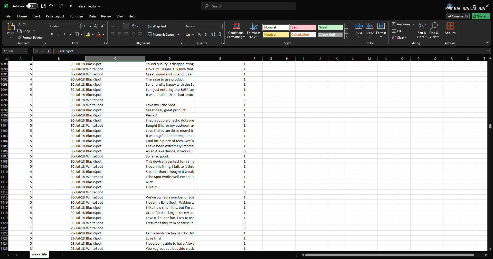

```{r setup, include=FALSE}
knitr::opts_chunk$set(echo = TRUE)
```


**1. Using the for loop, create an R script that will display a 5x5 matrix as shown in
Figure 1. It must contain vectorA = [1,2,3,4,5] and a 5 x 5 zero matrix.**
```{r}
vectorA = c(1,2,3,4,5)

matr <- matrix(nrow = 5, ncol = 5)

for(i in 1:5){
  for(j in 1:5){
    matr[i, j] <- vectorA[abs(i-j) + 1]
  }
}

for(i in 1:5){
  for(j in 1:5){
    cat(matr[i,j], " ")
  }
  cat("\n")
}

matri <- matrix(0, nrow = 5, ncol = 5)

for(i in 1:5){
  for(j in 1:5){
    cat(matri[i,j], " ")
  }
  cat("\n")
}
```

**2. Print the string "*" using for() function. The output should be the same as shown
in Figure**
```{r}
for(i in 1:5){
  for(j in 1:i){
    cat("*", " ")
  }
  cat("\n")
}
```

**3. Get an input from the user to print the Fibonacci sequence starting from the 1st input
up to 500. Use repeat and break statements. Write the R Scripts and its output.**
```{r}
#inp <- readline("Enter a number: ")
inp <- 1

f <- 0
s <- 1
repeat{
  if(f >= inp){
    cat(f, " ")
  }
  
  fibona <- f+s
  f <- s
  s <- fibona
  
  if(f > 500) break
}
```

**4. Import the dataset as shown in Figure 1 you have created previously.**
```{r}
#a. What is the R script for importing an excel or a csv file? Display the first 6 rows of
#   the dataset? Show your codes and its result.
shoesize <- read.csv("shoesize_data.csv")
head(shoesize)
#b. Create a subset for gender(female and male). How many observations are there in
#   Male? How about in Female? Write the R scripts and its output.
female <- subset(shoesize, Gender == "F", select = Gender)
female
male <- subset(shoesize, Gender == "M", select = Gender)
male
#c. Create a graph for the number of males and females for Household Data. Use plot(),
#   chart type = barplot. Make sure to place title, legends, and colors. Write the R scripts and
#   its result.
genders <- table(shoesize$Gender)

barplot(genders,
        main = "Number of Females and Males",
        xlab = "Gender",
        ylab = "Count",
        col = c("Pink", "Blue"),
        names.arg = c("Female", "Male"),
        legend = rownames(genders))
```

**5. The monthly income of Dela Cruz family was spent on the following:**
```{r}
# a. Create a piechart that will include labels in percentage.Add some colors and title of
#    the chart. Write the R scripts and show its output.
category <- c("Food", "Electricity", "Savings", "Miscellaneous")
val <- c(60, 10, 5, 25)
color = c("Orange", "Yellow", "Green", "Violet")
percent <- round(val / sum(val) * 100)
per_label <- paste(category, percent, "%")

pie(
  val, 
  col = color,
  main = "Dela Cruz Expenses",
  label = per_label
)

legend("left", category, fill = color)
```

**6. Use the iris dataset.**
```{r}
data(iris)
#a. Check for the structure of the dataset using the str() function. Describe what you
#   have seen in the output.
str(iris)
#[It shows the a data frame with the Sepal and Petal's lenght and width.]
#b. Create an R object that will contain the mean of the sepal.length,
#   sepal.width,petal.length,and petal.width. What is the R script and its result?
slength <- mean(iris$Sepal.Length)
swidth <- mean(iris$Sepal.Width)
plength <- mean(iris$Petal.Length)
pwidth <- mean(iris$Petal.Width)
means <- c(
  Sepal_Length = slength,
  Sepal_Width = swidth,
  Petal_Length = plength,
  Petal_Width = pwidth
)
means
#c. Create a pie chart for the Species distribution. Add title, legends, and colors. Write
#   the R script and its result.
iSpecies <- table(iris$Species)
species_color <- c("Purple", "Violet", "Yellow")
pie(
  iSpecies,
  main = "Species Distribution",
  col = species_color
)
legend("topleft", names(iSpecies), fill = species_color, title = "Species")
#d. Subset the species into setosa, versicolor, and virginica. Write the R scripts
#   and show the last six (6) rows of each species.
setosa <- subset(iris, Species == "setosa")
versicolor <- subset(iris, Species == "versicolor")
virginica <- subset(iris, Species == "virginica")
tail(setosa)
tail(versicolor)
tail(virginica)
#e. Create a scatterplot of the sepal.length and sepal.width using the different
#   species(setosa,versicolor,virginica). Add a title = “Iris Dataset”, subtitle = “Sepal
#   width and length, labels for the x and y axis, the pch symbol and colors should be based on
#   the species.
iris$Species <- as.factor(iris$Species)

colors <- c("blue", "purple", "green")
pch_symbols <- c(11, 13, 10) 

plot(iris$Sepal.Length, iris$Sepal.Width,
     col = colors[iris$Species],
     pch = pch_symbols[iris$Species],
     main = "Iris Dataset",
     sub = "Sepal Width and Length",
     xlab = "Sepal Length",
     ylab = "Sepal Width")

legend("topright", legend = levels(iris$Species),
       col = colors, pch = pch_symbols)
#f. Interpret the result.
#[--The scatterplot provides the correlation of Sepal.Length with Sepal.Width for the species 
#   iris—Virginica, #Versicolor, and Setosa.
#--Setosa is easily distinguished from the other species due to its distinct clustering 
#  and shorter sepal lengths.
#--In both dimensions, the ranges of virginica and versicolor overlap; in general, 
#  virginica has the longest sepals.]
```

**7. Basic Cleaning and Transformation of Objects**
```{r}
#Import the alexa-file.xlsx.
library("openxlsx")
alexa <- read.xlsx("alexa_file.xlsx")
#a. Rename the white and black variants by using gsub() function.
alexa$variation <- gsub("\\s+", " ", alexa$variation)
alexa$variation <- trimws(alexa$variation)

alexa$variation <- gsub("Black Dot", "BlackDot", alexa$variation)
alexa$variation <- gsub("Black Plus", "BlackPlus", alexa$variation)
alexa$variation <- gsub("Black Show", "BlackShow", alexa$variation)
alexa$variation <- gsub("Black Spot", "BlackSpot", alexa$variation)
alexa$variation <- gsub("White Spot", "WhiteSpot", alexa$variation)
alexa$variation <- gsub("White Show", "WhiteShow", alexa$variation)
alexa$variation <- gsub("White Plus", "WhitePlus", alexa$variation)
alexa$variation <- gsub("White Dot", "WhiteDot", alexa$variation)



```

